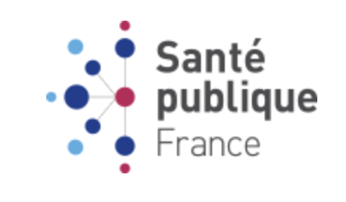

# Projet 3 - OpenClassrooms : CONCEVEZ UNE APPLICATION AU SERVICE DE LA SANTE PUBLIQUE

<u>*Auteur : Maxime SCHRODER*</u>

## Contexte

  

L'agence "Santé publique France" a lancé un appel à projets pour trouver des idées innovantes d’applications en lien avec l'alimentation. Vous souhaitez y participer et proposer une idée d’application.

## Données

Le jeu de données Open Food Facts est disponible soit sur le site officiel (https://world.openfoodfacts.org/)

Les champs sont séparés en quatre sections :
- Les informations générales sur la fiche du produit : nom, date de modification, etc.
- Un ensemble de tags : catégorie du produit, localisation, origine, etc.
- Les ingrédients composant les produits et leurs additifs éventuels.
- Des informations nutritionnelles : quantité en grammes d’un nutriment pour 100 grammes du produit.

## Mission 
1. Traitement du jeu de données en:
- Réfléchissant à une idée d’application.
- Repérant des variables pertinentes pour les traitements à venir, et nécessaires pour l'idée d’application.
- Nettoyant les données en :
    - Mettant en évidence les éventuelles valeurs manquantes, avec au moins 3 méthodes de traitement adaptées aux variables concernées.
    - Identifiant et en quantifiant les éventuelles valeurs aberrantes de chaque variable.
2. Production de visualisations tout au long de l'analyse afin de mieux comprendre les données et réalisation d'une analyse univariée pour chaque variable intéressante, afin de synthétiser son comportement.
3. Confirmation ou infirmation des hypothèses à l’aide d’une analyse multivariée, ainsi que la réalisation de tests statistiques appropriés pour vérifier la significativité des résultats.
4. Justification de l'idée d’application: identification des arguments justifiant la faisabilité (ou non) de l’application à partir des données d'Open Food Facts.

## Construction

Dans ce dépôt, vous trouverez :
1. Le notebook de pré-analyse, sélection et nettoyage des données: Notebook_1_nettoyage.ipynb
2. Le notebook exploratoire comprenant les analyses uni- et multivariées, une réduction dimensionnelle (Analyse en Composantes Principales (PCA)), la création des différents score nécessaire à l'idée d'application ainsi qu'une ébauche de celle-ci pour valider sa faisabilité : Notebook_2_exploration.ipynb
3. Le fichier contenant les différentes fonction utilisés dans les notebooks : fct_projet_3.py
4. Le support de présentation : Présentation.pdf
5. Le logo de santé publique france : Logo_sante_publique_france.png
6. Les fichiers pour la mise en place de l'environnement virtuel avec poetry : pyproject.toml et poetry.lock 